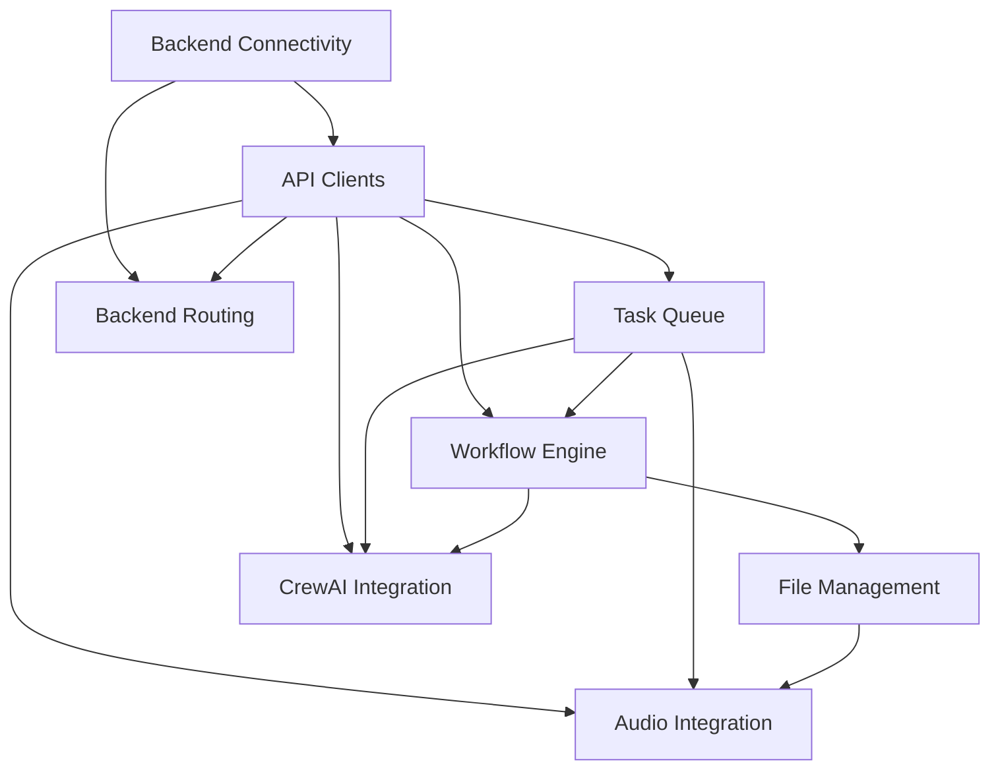

# Blender Movie Director - Epic Breakdown

This directory contains epic definitions for the Blender Movie Director project, following the BMAD Product Owner framework. Each epic represents a major deliverable chunk of functionality.

## PRD-001: Backend Integration Service Layer Epics

The following 8 epics comprehensively cover the Backend Integration Service Layer requirements:

### Foundation Epics (Critical Path)

1. **[EPIC-001: Backend Service Connectivity](./EPIC-001-backend-service-connectivity.md)** (P0)
   - Automatic service discovery and connection management
   - Health monitoring and recovery
   - Foundation for all other functionality
   - Timeline: ~4.5 weeks

2. **[EPIC-002: API Client Infrastructure](./EPIC-002-api-client-infrastructure.md)** (P0)
   - WebSocket, HTTP, and Gradio client implementations
   - Unified API abstractions for all backends
   - Mock implementations for testing
   - Timeline: ~5.5 weeks

3. **[EPIC-003: Task Queue and Async Operations](./EPIC-003-task-queue-async-operations.md)** (P0)
   - Non-blocking UI during generation
   - Priority queue management
   - Progress tracking system
   - Timeline: ~4.5 weeks

### Core Functionality Epics

4. **[EPIC-004: Workflow Execution Engine](./EPIC-004-workflow-execution-engine.md)** (P0)
   - Template-based workflow system
   - Parameter injection from Blender
   - Multi-step execution coordination
   - Timeline: ~6 weeks

5. **[EPIC-005: File Management and Asset Integration](./EPIC-005-file-management-asset-integration.md)** (P1)
   - Automatic file organization
   - Blender Asset Browser integration
   - Regenerative content model support
   - Timeline: ~4.5 weeks

### Advanced Integration Epics

6. **[EPIC-006: CrewAI Agent Tool Integration](./EPIC-006-crewai-agent-tool-integration.md)** (P1)
   - Film crew agent implementations
   - Tool wrapping for backend services
   - Inter-agent communication
   - Timeline: ~5.5 weeks

7. **[EPIC-007: Intelligent Backend Routing](./EPIC-007-intelligent-backend-routing.md)** (P2)
   - Smart backend selection
   - Quality/speed optimization
   - Failover handling
   - Timeline: ~4.5 weeks

8. **[EPIC-008: Audio Service Integration](./EPIC-008-audio-service-integration.md)** (P2)
   - RVC voice synthesis
   - AudioLDM sound effects
   - Music generation
   - Audio-video synchronization
   - Timeline: ~5.5 weeks

## Epic Dependencies

## Development Phases

### Phase 1: Foundation (Weeks 1-8)
- EPIC-001: Backend Service Connectivity
- EPIC-002: API Client Infrastructure  
- EPIC-003: Task Queue and Async Operations

### Phase 2: Core Features (Weeks 9-16)
- EPIC-004: Workflow Execution Engine
- EPIC-005: File Management and Asset Integration

### Phase 3: Intelligence Layer (Weeks 17-24)
- EPIC-006: CrewAI Agent Tool Integration
- EPIC-007: Intelligent Backend Routing
- EPIC-008: Audio Service Integration

## Success Metrics

Each epic includes specific success metrics. Key overall metrics for PRD-001:

- **Reliability**: >99% uptime for backend connections
- **Performance**: <100ms overhead per operation
- **Quality**: >95% task success rate
- **Usability**: >90% user satisfaction
- **Scalability**: Linear performance scaling

## Epic Template

All epics follow the BMAD Product Owner template structure:
- Epic Description and Business Value
- Scope & Boundaries
- Acceptance Criteria (Functional, Technical, Quality)
- User Stories with Story Points
- Technical Requirements and Architecture
- Integration Points with other epics/PRDs
- Risk Assessment and Mitigation
- Success Metrics
- Dependencies and Timeline

## Next Steps

1. Review and approve epics with stakeholders
2. Break down epics into sprint-ready user stories
3. Assign development teams to each epic
4. Create technical design documents
5. Set up epic tracking in project management tool