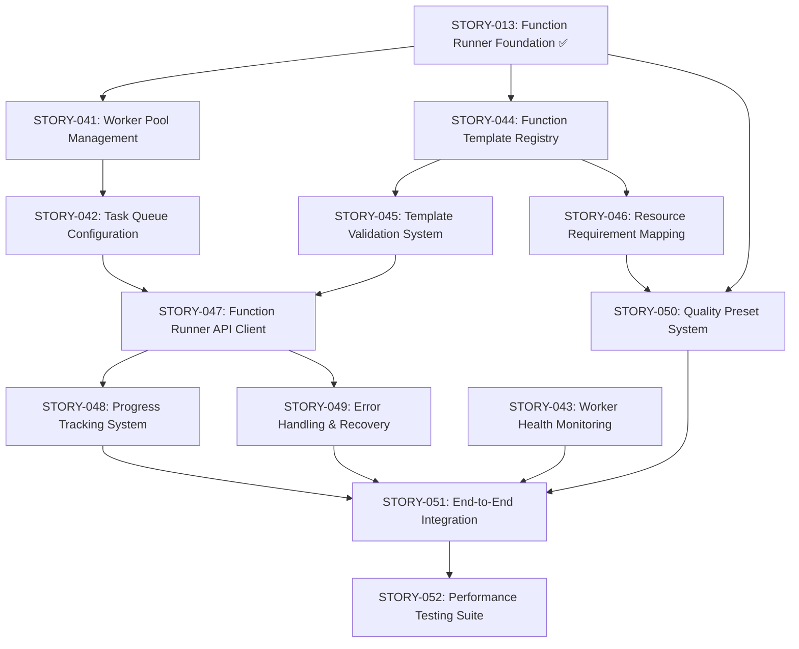

# Function Runner Architecture - User Stories

This directory contains all user stories for **EPIC-003: Function Runner Architecture**.

## Story Overview

### Worker Infrastructure Stories (20 points)
- **[STORY-041: Worker Pool Management](./STORY-041-worker-pool-management.md)** (8 points) ✅
  - Dynamic worker scaling, lifecycle management, graceful shutdown

- **[STORY-042: Task Queue Configuration](./STORY-042-task-queue-configuration.md)** (7 points) ✅
  - Intelligent routing, priority queuing, quality-based distribution

- **[STORY-043: Worker Health Monitoring](./STORY-043-worker-health-monitoring.md)** (5 points) ✅
  - Health checks, auto-recovery, monitoring dashboard

### Template Management Stories (18 points)
- **[STORY-044: Function Template Registry](./STORY-044-function-template-registry.md)** (8 points) ✅
  - Central registry, version management, metadata indexing

- **[STORY-045: Template Validation System](./STORY-045-template-validation-system.md)** (5 points)
  - Comprehensive validation, schema enforcement, error reporting

- **[STORY-046: Resource Requirement Mapping](./STORY-046-resource-requirement-mapping.md)** (5 points)
  - Resource allocation, GPU/CPU requirements, optimization profiles

### API Client Layer Stories (22 points)
- **[STORY-047: Function Runner API Client](./STORY-047-function-runner-api-client.md)** (10 points)
  - TypeScript client, type safety, request/response handling

- **[STORY-048: Progress Tracking System](./STORY-048-progress-tracking-system.md)** (7 points)
  - Real-time progress, WebSocket integration, UI components

- **[STORY-049: Error Handling & Recovery](./STORY-049-error-handling-recovery.md)** (5 points)
  - Robust error handling, retry logic, fallback mechanisms

### Quality Abstraction Stories (18 points)
- **[STORY-013: Function Runner Foundation](../web-platform-foundation/STORY-013-function-runner-foundation.md)** (12 points) ⚠️
  - Task dispatcher, quality mapping, WebSocket protocol (Partially Completed - 60%)

- **[STORY-050: Quality Preset System](./STORY-050-quality-preset-system.md)** (6 points)
  - User-friendly quality levels, preset management, configuration UI

### Integration & Testing Stories (12 points)
- **[STORY-051: End-to-End Integration](./STORY-051-end-to-end-integration.md)** (8 points)
  - Full platform integration, workflow testing, validation scenarios

- **[STORY-052: Performance Testing Suite](./STORY-052-performance-testing-suite.md)** (4 points)
  - Load testing, performance validation, benchmarking

## Total Story Points: 82 (40 Completed, 42 Remaining)

## Story Dependencies

### Critical Path (Foundation)


### Parallel Development Tracks

#### Track 1: Core Infrastructure
1. **STORY-041**: Worker Pool Management (8 points)
2. **STORY-042**: Task Queue Configuration (7 points)
3. **STORY-043**: Worker Health Monitoring (5 points)

#### Track 2: Template System
1. **STORY-044**: Function Template Registry (8 points)
2. **STORY-045**: Template Validation System (5 points)
3. **STORY-046**: Resource Requirement Mapping (5 points)

#### Track 3: Client Integration
1. **STORY-047**: Function Runner API Client (10 points)
2. **STORY-048**: Progress Tracking System (7 points)
3. **STORY-049**: Error Handling & Recovery (5 points)

#### Track 4: Quality & Testing
1. **STORY-050**: Quality Preset System (6 points)
2. **STORY-051**: End-to-End Integration (8 points)
3. **STORY-052**: Performance Testing Suite (4 points)

## Implementation Strategy

### Sprint 1: Foundation & Infrastructure (20 points)
- STORY-041: Worker Pool Management
- STORY-044: Function Template Registry
- Begin STORY-042: Task Queue Configuration

### Sprint 2: Template System & Quality (18 points)
- Complete STORY-042: Task Queue Configuration
- STORY-045: Template Validation System
- STORY-046: Resource Requirement Mapping
- STORY-050: Quality Preset System

### Sprint 3: API Client & Progress (17 points)
- STORY-047: Function Runner API Client
- STORY-048: Progress Tracking System

### Sprint 4: Error Handling & Integration (17 points)
- STORY-049: Error Handling & Recovery
- STORY-043: Worker Health Monitoring
- STORY-051: End-to-End Integration

### Sprint 5: Performance & Polish (4 points)
- STORY-052: Performance Testing Suite
- Bug fixes and optimizations

## Integration Points

### With EPIC-001 (Web Platform Foundation)
- WebSocket infrastructure for progress updates
- Task notification system integration
- Frontend node system receives results

### With EPIC-002 (Project & Asset Management)
- Results stored in project structure
- Takes system for version management
- Asset library for template storage

### With Future PRD-004 (Production Canvas)
- Canvas nodes trigger function execution
- Real-time preview of generation progress
- Node parameter interfaces

## Definition of Done Checklist

For each story to be considered complete:
- [ ] All acceptance criteria met
- [ ] Code follows project conventions
- [ ] Unit tests written and passing (>80% coverage)
- [ ] Integration tests validate workflow
- [ ] API documentation updated
- [ ] Frontend components responsive
- [ ] Error handling comprehensive
- [ ] Performance requirements met
- [ ] Code reviewed and approved
- [ ] No critical bugs or security issues

## Architecture Notes

### Function Interface Pattern
All functions implement the standardized `FunctionInterface`:
```python
class FunctionInterface(ABC):
    async def execute(self, params: dict, quality: str, project_path: str, progress_callback: Callable) -> FunctionResult
    def get_parameter_schema(self) -> dict
    def get_backend_type(self) -> str
```

### Quality Tiers
- **Draft** (was "low"): CPU-only, fast preview
- **Standard**: GPU acceleration, balanced quality/speed
- **High**: Enhanced quality, longer processing
- **Ultra** (was "premium"): Maximum quality, professional output

### Backend Support
- **ComfyUI**: Workflow-based image/video generation
- **Gradio**: Simple API-based models
- **Custom**: Direct script execution

## Notes

- Stories are designed to be independently deliverable where possible
- Foundation story (STORY-013) provides the base infrastructure
- Template system enables rapid function addition without code changes
- Quality abstraction simplifies user experience
- Comprehensive testing ensures production readiness
- Point estimates follow: Small (1-5), Medium (7-8), Large (10+)