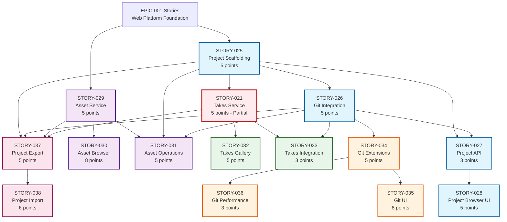

# EPIC-002 Story Dependency Graph

## Visual Dependency Flow



## Sprint Parallelization Opportunities

### Sprint 1: Foundation (Week 1-2)
```
Backend Team:
- STORY-025 (Days 1-5)
- STORY-026 (Days 3-7) - Can start once 025 directory structure is defined
- STORY-027 (Days 6-8)

Frontend Team:
- STORY-028 (Days 4-10) - Can start mockups early, integrate with API later
```

### Sprint 2: Assets (Week 3-4)
```
Backend Team:
- STORY-029 (Days 1-5)
- STORY-031 (Days 6-10) - Requires 029 service

Frontend Team:
- STORY-030 (Days 1-10) - Can develop with mock data initially
```

### Sprint 3: Takes (Week 5-6)
```
Backend Team:
- Complete STORY-021 (Days 1-2)
- STORY-033 (Days 3-5)

Frontend Team:
- STORY-032 (Days 1-8) - Can start with existing takes service
```

### Sprint 4: Git Advanced (Week 7-8)
```
Backend Team:
- STORY-034 (Days 1-5)
- STORY-036 (Days 6-8)

Frontend Team:
- STORY-035 (Days 2-10) - Heavy UI work
```

### Sprint 5: Import/Export (Week 9-10)
```
Full Team:
- STORY-037 (Days 1-5)
- STORY-038 (Days 6-10)
```

## Critical Dependencies

### Must Complete First
1. **STORY-025** - Everything depends on project structure
2. **STORY-026** - Git is foundational for version control

### Can Be Deferred
1. **STORY-036** - Performance optimization
2. **STORY-037/038** - Import/Export (nice to have)

### Parallel Work Opportunities
- **Frontend/Backend Split**: Most sprints allow parallel work
- **Asset System**: Can be developed independently once file APIs exist
- **Git UI**: Can use mock data while backend is built

## Risk Areas

### High Risk Dependencies
- **STORY-025 → All**: Project structure blocks everything
- **STORY-021 Partial**: Unknown remaining work could impact sprint 3
- **STORY-030**: Large UI component (8 points) could slip

### Mitigation Strategies
1. Start STORY-025 immediately with senior developer
2. Assess STORY-021 status in sprint planning
3. Consider splitting STORY-030 if needed
4. Keep STORY-037/038 as stretch goals