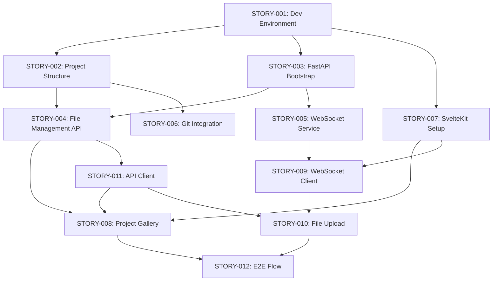

# Web Platform Foundation - User Stories

This directory contains all user stories for **EPIC-001: Web Platform Foundation**.

## Story Overview

### Infrastructure Stories
- **[STORY-001: Development Environment Setup](./STORY-001-development-environment-setup.md)** (2 points)
  - Setup scripts, environment configuration, and development workflow

- **[STORY-002: Project Structure Definition](./STORY-002-project-structure-definition.md)** (3 points)
  - Workspace/project directory creation, project.json schema, Git initialization

### Backend Stories
- **[STORY-003: FastAPI Application Bootstrap](./STORY-003-fastapi-application-bootstrap.md)** (3 points)
  - Basic FastAPI setup, middleware, error handling, health endpoints

- **[STORY-004: File Management API](./STORY-004-file-management-api.md)** (5 points)
  - Project CRUD operations, file upload/download, workspace management

- **[STORY-005: WebSocket Service](./STORY-005-websocket-service.md)** (5 points)
  - Real-time connection, event broadcasting, subscription management

- **[STORY-006: Git Integration Service](./STORY-006-git-integration-service.md)** (3 points)
  - Git repository initialization, commit functionality, status tracking

### Frontend Stories
- **[STORY-007: SvelteKit Application Setup](./STORY-007-sveltekit-application-setup.md)** (2 points)
  - SvelteKit initialization, TypeScript config, routing structure

- **[STORY-008: Project Gallery View](./STORY-008-project-gallery-view.md)** (5 points)
  - Project listing, creation dialog, grid/list views, search/sort

- **[STORY-009: WebSocket Client](./STORY-009-websocket-client.md)** (3 points)
  - Connection management, auto-reconnect, event dispatching

- **[STORY-010: File Upload Component](./STORY-010-file-upload-component.md)** (3 points)
  - Drag-and-drop uploads, progress tracking, validation

### Integration Stories
- **[STORY-011: API Client Setup](./STORY-011-api-client-setup.md)** (2 points)
  - TypeScript API client, error handling, interceptors

- **[STORY-012: End-to-End Project Flow](./STORY-012-end-to-end-project-flow.md)** (3 points)
  - Complete integration testing, verification of all components

## Total Story Points: 40

## Story Dependencies

## Implementation Order

### Sprint 1 (Weeks 1-2)
1. STORY-001: Development Environment Setup
2. STORY-002: Project Structure Definition  
3. STORY-003: FastAPI Application Bootstrap
4. STORY-007: SvelteKit Application Setup
5. STORY-011: API Client Setup
6. STORY-004: File Management API

### Sprint 2 (Weeks 3-4)
1. STORY-005: WebSocket Service
2. STORY-009: WebSocket Client
3. STORY-006: Git Integration Service
4. STORY-008: Project Gallery View
5. STORY-010: File Upload Component
6. STORY-012: End-to-End Project Flow

## Definition of Done Checklist

For each story to be considered complete:
- [ ] All acceptance criteria met
- [ ] Code follows project conventions
- [ ] Unit tests written and passing
- [ ] Integration points verified
- [ ] Documentation updated
- [ ] Code reviewed and approved
- [ ] No critical bugs or issues

## Notes

- Stories are designed to be independently deliverable where possible
- Infrastructure and setup stories should be completed first
- Integration story (STORY-012) validates the entire epic
- Each story includes detailed implementation notes and code examples
- Point estimates follow: Small (1-3), Medium (5-8), Large (13+)